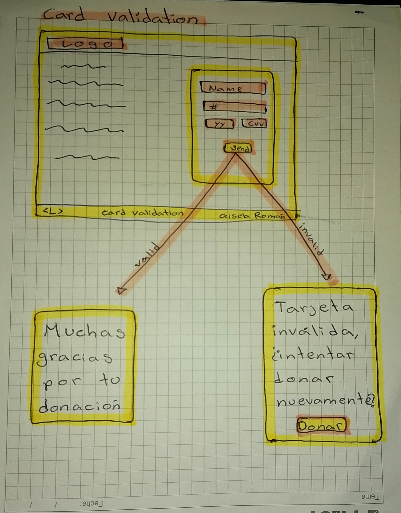
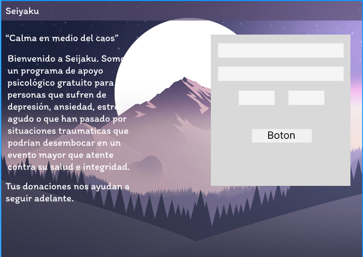
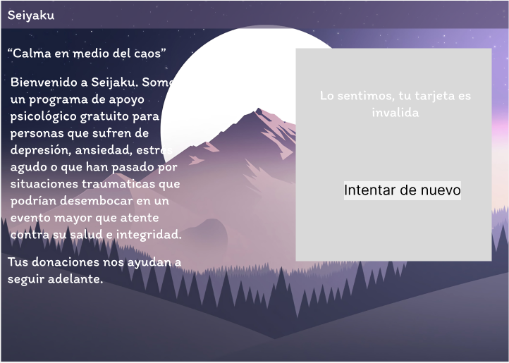
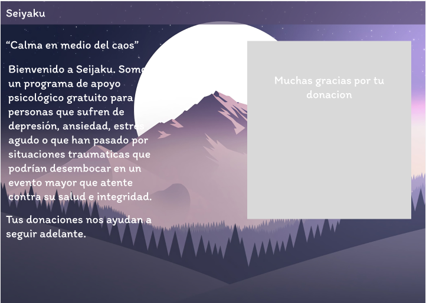

# Tarjeta de crédito válida

## 1. Información general
   -Utilizar el Algoritmo de Luhn para realizar un validador de tarjeta de crédito 
   -Generar una función que oculte los digitos de la tarjeta (excepto los ultimos 4)
## 2. Temática
      -Senjaku que una asociación que otorga apoyo psicológico a personas con problemas de ansiedad, 
       depresión  y estrés.
      -Trabajamos de la mano de profesionales y para ello dependemos de las donaciones que nos
       otorgan distintos usuarios e instituciones.
      -Esta página es la página de donaciones de Senjaku.
        
## 3.Prototipo de baja fidelidad
  

## 4.Prototipo de alta fidelidad

  
  
  

## 5. Los criterios de aceptación mínimos del proyecto:
* [ ] Tiene una interfaz que permite a la usuaria saber si la tarjeta es valido y ocultar el numero hasta las 4 ultimos digitos
* [ ] El proyecto será entregado incluyendo pruebas unitarios de los métodos de `validator` (`isValid` y `maskify`) 
* [ ] El proyecto será entregado libre de _errores_ de `eslint` (_warnings_ son ok)
* [ ] El proyecto será entregado subiendo tu código a GitHub.
* [ ] La interfaz será "desplegada" usando GitHub Pages. 
* [ ] El README contiene una definición del producto
